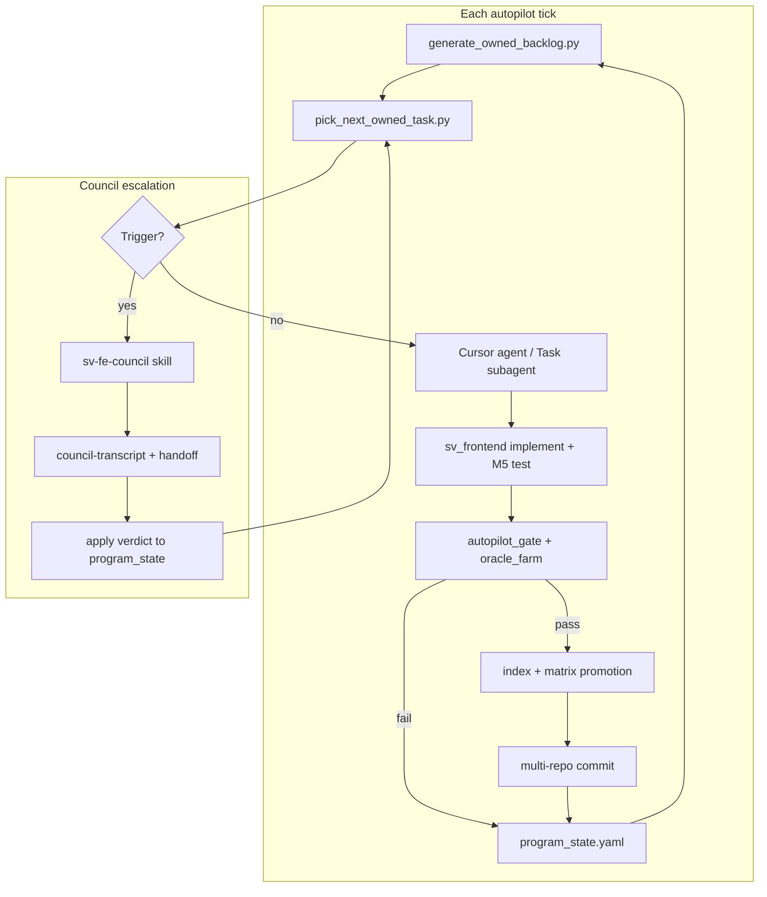

# Full autopilot plan (owned IEEE 1800 program)

## Can this be done?

**Yes — for the mechanical development loop**, with council used only on **policy forks**, not on every clause.

**No — for “zero human touch until v4.0 cert”** without accepting risk on marketing honesty, merge conflicts, and hard LRM semantics. The honest target is **Level 3 autonomy** (below): agents run continuously; humans approve council escalations and rare cert/tag events.

What you already have (~60% of the control plane):

| Piece | Location | Role |
|-------|----------|------|
| Gap → task generator | `scripts/generate_owned_backlog.py` | 274 `ST-OWNED-*` + chapter gates |
| File ownership / pods | `docs/orchestration/FILE_OWNERSHIP.yaml` | Parallel agents without `parser.cpp` wars |
| Gates | `sv_frontend/scripts/run_autopilot_gate.sh`, `run_oracle_farm.sh` | Objective merge bar |
| Implementation tick | `scripts/run_implementation_loop.sh` | Regenerate backlog + gate + oracle sample |
| Council | `SV_UPF_SPEC/docs/orchestration/SV_FE_COUNCIL.md`, `.cursor/skills/sv-fe-council` | Tranche / cert / scope decisions |
| Master orchestrator | `.cursor/skills/sv-fe-master-orchestrator` | Dispatch template + phase rules |

What must be added for **unattended** operation (~40%):

1. **Task picker** — deterministic “next `ST-OWNED-*`” from backlog + `program_state.yaml`
2. **Autopilot driver** — one entry script that: pick → dispatch agent prompt → verify → promote index → commit → push → update state
3. **Council escalation router** — auto-invoke council skill only when triggers fire (see §4)
4. **Multi-repo transaction** — spec index + product + contract in one logical “tranche” with rollback on gate fail
5. **Scheduler** — Cursor `/loop` or CI cron calling the driver

---

## Autonomy levels (pick target: Level 3)

| Level | Human | Agent | Council |
|-------|-------|-------|---------|
| L0 Manual | Picks every task | Implements when asked | Ad hoc |
| L1 Assisted | Approves tranche | Runs loop on command | On request |
| L2 Scheduled | Reads digest only | `/loop` every N hours | On gate fail >3x |
| **L3 Autopilot (recommended)** | Council + cert tags only | Continuous pick/implement/merge | Auto on §4 triggers |
| L4 Unsupervised cert | None | Tags `v4.0-owned-lrm-cert` | Pre-approved policy doc only |

**Program default: L3.** L4 is out of scope until parity dashboards and council policy are frozen in writing.

---

## Control plane architecture



**Single source of truth for “what’s next”:**

1. `docs/orchestration/phase_backlog_owned.yaml` — task statuses
2. `docs/orchestration/program_state.yaml` — active wave, last completed, parallel caps
3. `SV_UPF_SPEC/SV_SPEC/lrm_clause_index.yaml` — promoted truth

---

## Per-tick algorithm (implementer-agnostic)

Each tick runs exactly this sequence:

1. **Refresh** — `python3 scripts/generate_owned_backlog.py --check`
2. **Workspace** — `python3 scripts/check_workspace.py`
3. **Pick** — next eligible `ST-OWNED-*` (rules in §3)
4. **Classify** — `implement` | `defer_roadmap` | `escalate_council`
5. **If implement**
   - Fill `contracts/<id>.yaml` from `schemas/clause_factory_contract.yaml`
   - Edit only pods allowed in `FILE_OWNERSHIP.yaml`
   - Add `feature_tests/<stem>` + `test_sv_m5_*` in `sv_frontend`
   - Run `run_autopilot_gate.sh` + `run_oracle_farm.sh --stem <stem>`
6. **If defer_roadmap** — set backlog `status: deferred`, index stays `roadmap`/`partial`, no false `supported`
7. **If escalate_council** — run council skill; block pick until `apply council verdict`
8. **Promote** — index row + `LRM_COVERAGE_MATRIX.md` in same logical tranche
9. **Commit** — three repos with linked message footer: `Owned-Tranche: ST-OWNED-XX-YYY`
10. **Push** — `origin master` (or PR if branch protection added later)
11. **Update state** — `last_completed_subtask`, metrics, `next_orchestrator_actions`

**Stop conditions (notify human, do not spin):**

- Gate fails 3 times on same `ST-OWNED-*`
- Merge conflict on owned pod file
- IR schema version bump
- `support_status: supported` would contradict council SCOPE-LOCK
- Oracle parity &lt; 0.99 on promoted stem

---

## Task picker rules (`pick_next_owned_task.py` — to build)

Priority order:

1. **Unblock chapter gates** — if all `ST-OWNED-CH{n}-*` in a chapter are `completed` or `deferred`, close `ST-OWNED-GATE-CH{n}`
2. **Active wave** — tasks tagged `owned-lrm-waveN` in `program_state.active_phase`
3. **Pod-safe parallel batch** — up to `parallel_dispatch.max` (default 3) tasks with disjoint `FILE_OWNERSHIP` paths
4. **Chapter weight** — prefer chapter 9 procedural while `gap_clauses` largest there
5. **Skip** — `(roadmap)` in title → auto `defer_roadmap` without implementation attempt

Dependencies: honor `depends_on` in `phase_backlog_owned.yaml`.

---

## Council integration (automated escalation only)

Council is **not** run every task. Run `sv-fe-council` when **any** trigger matches:

| Trigger ID | Condition | Example decision |
|------------|-----------|------------------|
| C-SCOPE | Promoting &gt;5 clauses changes cert/marketing tier | Batch promotion to `supported` |
| C-ORDER | Two chapters tie for priority with different risk | CH9 vs CH16 ordering |
| C-DEFER | Implement vs `roadmap` unclear for indexed clause | `foreach`, streaming, classes |
| C-PARITY | Oracle parity &lt; 0.99 but implement “done” | Accept slang diff vs fix owned |
| C-ARCH | IR schema, parser TU split, new pod | IR v3 → v3.0 stable |
| C-LEGACY | Change affects v1.x SCOPE-LOCK / hybrid claims | Index wording in legacy program |
| C-STUCK | Same subtask failed gates 3× | Abandon vs redesign approach |

**Automated council flow:**

1. Autopilot writes `docs/council/autopilot-escalation-<ST-ID>.md` with evidence (logs, parity %, diff paths)
2. Agent invokes **sv-fe-council** with that file as brief
3. Chairman transcript saved under `SV_UPF_SPEC/docs/council/`
4. Script `scripts/apply_council_verdict.py` (to build) copies `proposed_next_orchestrator_actions` → both `program_state.yaml` files
5. Autopilot resumes from picker

Humans only need to say **apply council verdict** if the skill did not auto-apply.

---

## Parallel execution (megaswarm-safe)

From `FILE_OWNERSHIP.yaml` + council reference:

| Pod | Max concurrent agents |
|-----|------------------------|
| `parser_tokens`, `parser_skip`, `parser_expr` | 1 each |
| `parser_always`, `parser_module`, `parser_generate`, `parser_sva` | 1 each |
| `sema`, `lower`, `ir_export` | 1 each |
| `tests_m5`, `eval_corpus` | 2 (read-only corpus + tests) |
| `lrm_indexer` | 1 (serial promotions) |

**Integrator role** (one agent per tick if not parallel): merge queue for `parser.cpp` residual — prefer edits only in split TUs.

---

## Scheduler options

### A. Cursor `/loop` (local, fastest to adopt)

```text
/loop 2h Run SV_OWNED_LRM autopilot tick: read docs/plans/2026-05-28-owned-lrm-full-autopilot.md §Per-tick algorithm, execute one ST-OWNED-* tranche, council only on §4 triggers, commit+push on green gate.
```

Use **dynamic loop** when gate is red: back off until fix merged.

### B. Shell driver (no IDE)

`scripts/run_owned_autopilot.sh` (to build):

- Calls picker → writes `docs/orchestration/next_handoff.md`
- Exits 0 with handoff for external agent (Cursor Cloud Agent, `cursor agent`, or CI)
- Optional `--non-interactive` runs implementer via Task API if available

### C. GitHub Actions (nightly tranche)

Workflow on `SV_OWNED_LRM`:

- checkout sibling repos via PAT
- run gate on `sv_frontend`
- open PR instead of push to `master` if branch protection enabled

---

## Multi-repo commit contract

One tranche = atomic intent across repos:

| Repo | Changes |
|------|---------|
| `sv_frontend` | Code + M5 test + matrix row |
| `SV_UPF_SPEC` | `lrm_clause_index.yaml` + optional `program_state` link |
| `SV_OWNED_LRM` | `contracts/ST-OWNED-*.yaml` + backlog status + `program_state` |

Commit message template:

```text
Owned-Tranche: ST-OWNED-9-042

Implement <LRM-ID> with owned parse + M5 test.
Refs: contracts/ST-OWNED-9-042.yaml
```

Use `source scripts/git_commit_env.sh` in `SV_OWNED_LRM` for identity.

---

## Metrics dashboard (autopilot health)

Update each tick in `program_state.yaml`:

```yaml
autopilot:
  level: 3
  ticks_total: 0
  tasks_completed: 1
  tasks_deferred: 0
  council_escalations: 0
  gate_fail_streak: 0
  last_tick_at: null
  last_gate: ok
```

Optional: script `scripts/autopilot_metrics.py` prints gap burn-down from index.

---

## Implementation backlog for the control plane itself

| ID | Deliverable | Unblocks |
|----|-------------|----------|
| AP-01 | `scripts/pick_next_owned_task.py` | **Done** — deterministic work queue |
| AP-02 | `scripts/run_owned_autopilot.sh` | **Done** — one-command tick |
| AP-03 | `scripts/apply_council_verdict.py` | Resume after council |
| AP-04 | `docs/orchestration/next_handoff.md` template | Agent dispatch |
| AP-05 | `.cursor/skills/sv-owned-lrm-autopilot/SKILL.md` | Cursor-native loop |
| AP-06 | Update backlog statuses from git/tags | Drift repair |
| AP-07 | GitHub Action `owned-autopilot.yml` | Unattended nightly |

**Wave 0 is done.** Start AP-01..AP-02, then resume clause work at `ST-OWNED-9-*` per current `program_state.yaml`.

---

## Honest limits (do not over-promise)

1. **274 clauses ≠ 274 equal effort** — many are roadmap-sized (classes, SVA, constraints); autopilot must defer honestly.
2. **Council is advisory** — it does not replace gates; unanimous bad advice still fails pytest.
3. **Slang oracle** — parity disputes need human-readable diffs; automate collection, not blind acceptance.
4. **Secrets / credentials** — push and gh require machine auth; agent cannot set global `git config`.
5. **True “complete independence”** — achievable for **implementation tranches**; not for **commercial cert sign-off** without a human.

---

## Recommended next action

1. Approve **Level 3** as program default in `program_state.yaml`.
2. Implement **AP-01** and **AP-02** (half day).
3. Arm Cursor `/loop 2h` with autopilot skill prompt.
4. First tranche after picker: **ST-OWNED-GATE-CH11** close (defer 11-002..004) then **ST-OWNED-9-*** batch of 5 pod-safe items.

This yields a system that works **mostly independently**, uses **council only when guidance is required**, and never marks `supported` without owned proof.
